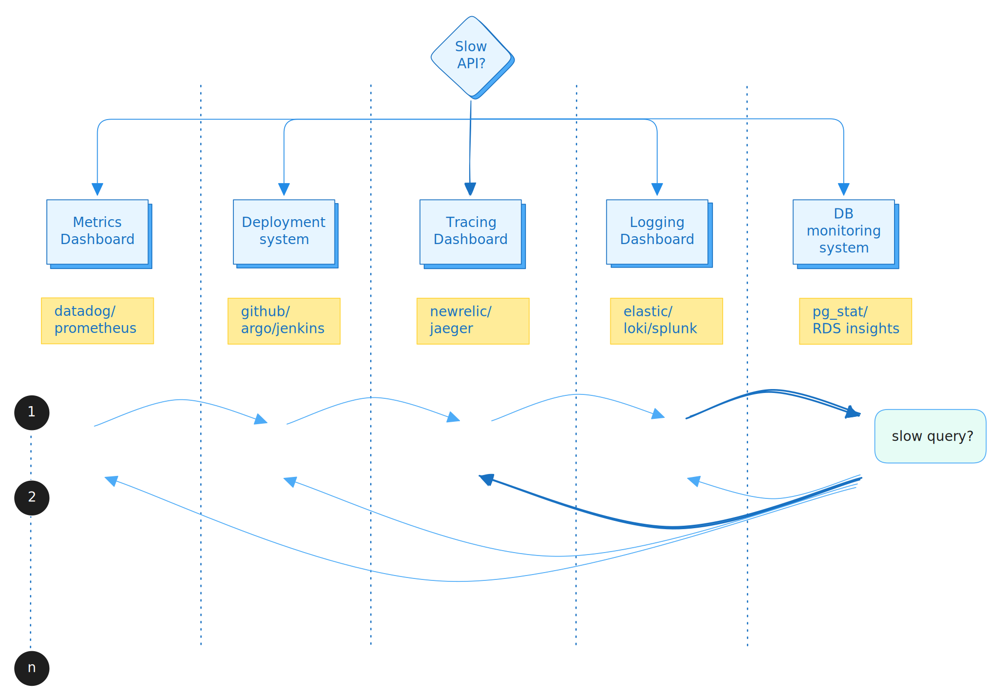

<iframe
  width="100%"
  height="400"
  src="https://www.youtube.com/embed/ipZdwMLO94s"
  title="YouTube video player"
  frameborder="0"
  allow="accelerometer; autoplay; clipboard-write; encrypted-media;
    gyroscope; picture-in-picture; web-share"
  allowfullscreen>
</iframe>

Modern software systems do not fail along clean architectural boundaries.
Application latency, database contention, infrastructure saturation, and user
behavior are tightly coupled, yet most observability setups continue to treat
them as separate concerns. PostgreSQL, despite being a core component in most
production systems, is often monitored in isolation-through a separate tool,
separate dashboards, and separate mental models.

This separation works when systems are small and traffic patterns are simple.
As systems scale, however, PostgreSQL behavior becomes a direct function of
application usage: query patterns change with features, load fluctuates with
users, and database pressure reflects upstream design decisions. At this stage,
isolating database monitoring from application and infrastructure observability
actively slows down diagnosis and leads teams to optimize the wrong layer.

In-depth PostgreSQL monitoring is necessary-but depth alone is not sufficient.
Metrics without context force engineers to manually correlate symptoms across
tools, timelines, and data models. What is required instead is component-level
observability, where PostgreSQL metrics live alongside application traces,
infrastructure signals, and deployment events, sharing the same time axis and
the same analytical surface.

This is why PostgreSQL observability belongs in the same place as application
and infrastructure observability. When database behavior is observed as part of
the system rather than as a standalone dependency, engineers can reason about
causality instead of coincidence, and leaders gain confidence that performance
issues are being addressed at their source-not just mitigated downstream.

<!--truncate-->

## Why PostgreSQL Is Commonly Observed in Isolation?

PostgreSQL's popularity is not accidental. Its defaults are sensible, its
abstractions are strong, and it shields teams from operational complexity early
in a system's life. Standard views such as pg\_stat\_activity,
pg\_stat\_statements, and replication statistics provide enough visibility to
operate comfortably at a modest scale.

As a result, many teams adopt a mental model where:

* The application is monitored via APM and logs
* Infrastructure is monitored via host or container metrics
* The database is monitored "over there," often with a specialized tool

This division is rarely intentional. It emerges organically from tooling
ecosystems and organizational boundaries. Database monitoring tools evolved
separately, application observability evolved separately, and teams adapted
around the seams.

The problem is that the system itself does not respect these seams.

## The Inflection Point: When Isolation Stops Working

There is a predictable point where this model begins to fail. It typically
coincides with one or more of the following:

* Increased concurrency and mixed workloads
* Features that introduce new query shapes or access patterns
* Multi-tenant or user-driven traffic variability
* Latency budgets that tighten as the product matures

At this stage, PostgreSQL metrics start reflecting *effects*, not *causes*.

Engineers see:

* Rising query latency without obvious query changes
* Lock contention that appears sporadic
* CPU or IO pressure that correlates weakly with query volume
* Replication lag that spikes during "normal" traffic

Each tool shows part of the picture, but none show the system.

*Jumping through dashboards to correlate, step after step, adds to erroneous
attribution and higher MTTR*

The engineer is forced into manual correlation:

* Jumping between dashboards
* Aligning timelines by eye
* Inferring causality from coincidence

This is not an engineer skill problem. It is a tooling model problem. As
dedicated DBA roles continue to vanish, we must put expert-level tooling
directly into the hands of every developer. pgX doesn't just show data; it
empowers every engineer to perform the deep-dive analysis traditionally
reserved for database specialists

## The Cost of Split Observability

When database observability is isolated, several failure modes become common:

| | **Technical Impact** | **Organizational Impact** |
|---|---|---|
| **During Incidents** | **Slower Response** - Engineers spend time *proving* whether the database is the cause or the victim. Valuable minutes are lost ruling things out instead of addressing the root cause. | **Blurred Ownership** - "Database issue" and "application issue" become political labels rather than technical diagnoses. Accountability diffuses. |
| **After Incidents** | **Incorrect Optimization** - Teams tune queries when the real issue is connection churn, or scale infrastructure when the bottleneck is lock contention driven by application behavior. | **Leadership Mistrust** - When explanations rely on inferred correlation rather than observed causality, confidence erodes-both in the tools and in the process. |

These are organizational costs, not just technical ones.

## Databases Are Not Dependencies \- They Are Components

A critical mental shift is required: PostgreSQL is not just an external
dependency that occasionally misbehaves. It is a stateful component whose
behavior is continuously shaped by the application.

Queries do not exist in isolation. They are the result of:

* User behavior
* Feature flags
* Request fan-out
* ORM behavior
* Deployment changes
* Background jobs and scheduled work

Observing PostgreSQL without this context is akin to observing CPU usage
without knowing which process is running.

True observability requires that all major components of a system be observed
together, not just deeply.

## What "Bridging the Gap" Actually Means

Bridging database and application monitoring requires structural alignment:

| Requirement | Description |
|---|---|
| **Shared Time Axis** | PostgreSQL metrics, application traces, and infrastructure signals must be observable on the same timeline, dashboards and logs, without manual alignment. |
| **Shared Identifiers** | Queries, requests, services, and hosts should be linkable through consistent labels and metadata. |
| **Unified Storage** | Data should live in the same analytical backend, enabling cross-signal analysis rather than stitched views. |
| **One Alerting Surface** | Alerts should trigger based on system behavior, not tool-specific thresholds, and remediation should not require jumping between platforms. |
| **Integrated Workflows** | Investigation workflows should flow seamlessly from application symptoms to database causes, without context switching. |

## Depth Alone Is Not Enough

Many teams respond to observability gaps by adding more detailed database
monitoring. While depth is necessary, it introduces new challenges when
implemented in isolation:

* High-cardinality metrics become expensive and noisy
* Engineers struggle to determine which signals matter
* Data volume grows without improving understanding

Depth without context increases cognitive load. Depth with context reduces it.
To truly reduce cognitive load, a tool needs to act as a guide. It should
enable engineers to understand the 'why' behind Postgres behaviors like
vacuuming issues or index bloat providing the guardrails and insights needed
to master the database layer without a steep learning curve

As compared to collecting every possible PostgreSQL metric and analyzing in
isolation, the right approach is to observe the database as it participates
in the system.

## PostgreSQL Observed as Part of the System

When PostgreSQL observability is unified with application and infrastructure
observability, several things change:

* Query latency is evaluated against request latency, not in isolation
* Lock contention is correlated with deployment or traffic patterns
* Resource pressure is interpreted in light of workload mix
* Performance regressions are traced to code paths, not just queries

Instead of asking "What is the database doing?" engineers start asking "Why is
the system behaving this way?"

That distinction marks a fundamental cultural shift.

## The Strategic Implication for Engineering Leaders

For engineering leaders, this shift is not merely technical. It affects:

* Mean time to resolution
* Reliability perception across teams
* Cost efficiency of scaling decisions
* Confidence in operational readiness

Fragmented observability systems scale poorly-not just in cost, but in
organizational trust.

Choosing to observe PostgreSQL alongside application and infrastructure signals
is a statement about how seriously an organization treats system understanding.

## Introducing pgX

To address these challenges, we are excited to introduce **pgX**, Base14's
PostgreSQL observability integration designed to unify database monitoring with
application and infrastructure observability.

pgX captures PostgreSQL diagnostic and monitoring data at a depth no other
observability platform offers-and integrates it directly alongside your
application traces, logs, and infrastructure metrics. This allows engineers to
analyze database behavior in the context of application performance and
infrastructure health, enabling faster diagnosis and more effective
optimization.

## Getting Started

PostgreSQL remains the default database for a reason: it is robust, flexible,
and capable of supporting complex workloads. But as systems grow, the way
PostgreSQL is observed must evolve.

In-depth monitoring is table stakes. What differentiates effective teams is
whether that depth exists in context. With pgX, you get comprehensive Postgres
metrics flowing into the same data lake as your application and infrastructure
telemetry-designed for correlation, not just collection.

You can find the technical setup in our
[documentation](https://docs.base14.io/category/postgresql-advanced-monitoring).
And if you're navigating this exact problem-figuring out how to unify database
observability with the rest of your stack-we'd be interested to hear how you're
approaching it.

*In our next post, we'll dive deeper into what pgX collects and the
visualizations it provides to help you understand your PostgreSQL performance
at a glance.*
