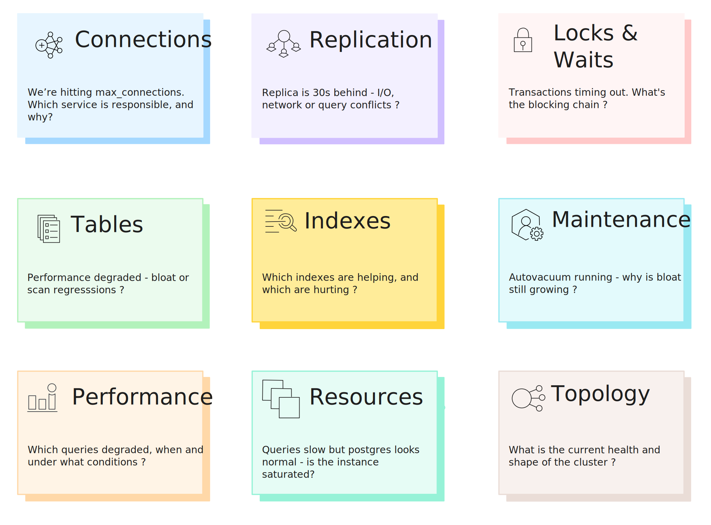

For many teams, PostgreSQL monitoring begins and often ends with
`pg_stat_statements`. That choice is understandable. It provides normalized
query statistics, execution counts, timing data, and enough signal to identify
slow queries and obvious inefficiencies. For a long time, that is sufficient.

But as PostgreSQL clusters grow in size and importance, the questions engineers
need to answer change. Instead of *"Which query is slow?"*, the questions
become harder and more operational:

* Why is replication lagging right now?  
* Which application is exhausting the connection pool?  
* What is blocking this transaction?  
* Is autovacuum keeping up with write volume?  
* Did performance degrade because of query shape, data growth, or resource pressure?

These are not questions `pg_stat_statements` is designed to answer.

Most teams eventually respond by stitching together ad-hoc queries against
`pg_stat_activity`, `pg_locks`, `pg_stat_replication`, `pg_stat_user_tables`,
and related system views. This works until an incident demands answers in
minutes, not hours.

This post lays out what *comprehensive PostgreSQL monitoring* actually looks
like at scale: the **nine observability domains that matter**, the kinds of
metrics each domain requires, and why moving beyond query-only monitoring is
unavoidable for serious production systems.

<!--truncate-->

## What pg\_stat\_statements Does Well

Before discussing its limits, it is worth acknowledging what
`pg_stat_statements` does exceptionally well.

It provides:

* Normalized, per-query execution statistics  
* Call counts and total execution time  
* Min, max, mean, and standard deviation of execution time  
* Buffer hits vs reads  
* Temporary file usage  
* Planning time (PostgreSQL 13+)  
* WAL byte generation (PostgreSQL 13+)

These metrics enable teams to:

* Identify slow or expensive queries  
* Detect N+1 query patterns  
* Track query regressions after deployments  
* Find cache-inefficient query shapes  
* Understand which queries dominate workload

For early-stage systems, or for focused query optimization work, this is
invaluable. It answers the first generation of performance questions clearly
and efficiently.

However, several limitations become significant at scale:

* Statistics reset on restart unless persisted externally  
* No visibility into query plans  
* No real-time view of current contention  
* Limited to top-level statements  
* Storage overhead grows with high query diversity  
* No context about *why* queries are slow at a given moment

These limitations are not flaws. They reflect the narrow scope
`pg_stat_statements` was designed for. The problem arises when teams expect it
to explain behaviors that live outside that scope.

## The 9 Observability Domains Every Engineer Should Know

At scale, PostgreSQL behavior is shaped by far more than query execution time.
Comprehensive monitoring requires visibility across nine distinct domains, each
answering a different class of operational question.

### Domain 1: Connections

Connection behavior often explains system instability long before queries look
slow. pgX tracks connection state, ownership, and duration patterns.

| Signal | Why It Matters |
|--------|----------------|
| Total connections vs `max_connections` | Headroom before exhaustion |
| State breakdown (active, idle, idle in transaction) | Identifies connection leaks |
| Connections by `application_name` | Pinpoints responsible service |
| Connection duration heatmaps | Reveals long-lived connection patterns |

:::tip[Key pgX Metrics]
`pg_connections`, `pg_backend_type_count`, `pg_backend_age_seconds`,
`pg_backend_wait_events` [[1]](#footnotes)
:::

**Key question:** *"We're hitting max_connections. Which service is responsible?"*

### Domain 2: Replication

Replication health determines both performance and reliability. pgX monitors
lag, WAL flow, and standby conflicts across your entire topology.

| Signal | Why It Matters |
|--------|----------------|
| Write, flush, and replay lag per standby | Pinpoints where lag occurs |
| WAL generation rate | Baseline for capacity planning |
| Replication slot state | WAL retention risk |
| Standby conflicts (snapshot, lock, buffer pin) | Explains unexpected lag spikes |

:::tip[Key pgX Metrics]
`pg_replication_lag_milliseconds`, `pg_replication_outgoing`,
`pg_replication_slot_lag_bytes`, `pg_replication_incoming` [[1]](#footnotes)
:::

**Key question:** *"The replica is 30 seconds behind - I/O, network, or query conflicts?"*

### Domain 3: Locks & Waits

Locking behavior is emergent. It arises from concurrency patterns, transaction
duration, and workload shape. pgX surfaces blocking chains and wait events in
real time.

| Signal | Why It Matters |
|--------|----------------|
| Lock counts by type (relation, tuple, txid, advisory) | Categorizes contention |
| Lock wait queue depth | Shows contention severity |
| Blocking session chains | Identifies who blocks whom |
| Wait event distribution (Lock, LWLock, IO, BufferPin) | Classifies wait types |
| Deadlock frequency | Detects design issues |

:::tip[Key pgX Metrics]
`pg_locks_count`, `pg_lock_detail`, `pg_blocking_pids`,
`pg_backend_wait_events` [[1]](#footnotes)
:::

**Key question:** *"Transactions are timing out. What's the blocking chain?"*

### Domain 4: Tables

Table-level health directly impacts performance and predictability. pgX tracks
bloat, cache efficiency, scan patterns, and freeze age per table.

| Signal | Why It Matters |
|--------|----------------|
| Live vs dead tuple counts | Bloat indicator |
| Estimated bloat percentage | Maintenance urgency |
| Cache hit ratio per table | Hot vs cold data |
| Sequential vs index scan counts | Query plan efficiency |
| Row activity (inserts, updates, deletes, HOT) | Write pattern visibility |
| Freeze age | Wraparound risk |

:::tip[Key pgX Metrics]
`pg_table_stats`: `n_live_tup`, `n_dead_tup`, `bloat_bytes`, `seq_scan`,
`idx_scan`, `heap_blks_hit`, `age_relfrozenxid` [[1]](#footnotes)
:::

**Key question:** *"Performance degraded - bloat or scan regressions?"*

### Domain 5: Indexes

Indexes improve read performance but impose write overhead and maintenance
cost. pgX measures index usage, efficiency, and bloat to identify optimization
opportunities.

| Signal | Why It Matters |
|--------|----------------|
| Index scan counts | Usage frequency |
| Tuples read vs fetched | Selectivity efficiency |
| Index cache hit ratios | Memory effectiveness |
| Index bloat estimates | Maintenance needs |
| Unused/rarely used indexes | Candidates for removal |

:::tip[Key pgX Metrics]
`pg_index_stats`: `idx_scan`, `idx_tup_read`, `idx_tup_fetch`, `idx_blks_hit`,
`bloat_bytes`, `size_bytes` [[1]](#footnotes)
:::

**Key question:** *"Which indexes are helping, and which are hurting?"*

### Domain 6: Maintenance (Vacuum & Analyze)

Maintenance debt accumulates quietly and surfaces as sudden performance
regressions. pgX tracks vacuum and analyze activity, dead tuple growth, and
autovacuum effectiveness.

| Signal | Why It Matters |
|--------|----------------|
| Last vacuum/autovacuum per table | Maintenance recency |
| Last analyze/autoanalyze per table | Statistics freshness |
| Dead tuple accumulation rate | Bloat velocity |
| Autovacuum worker activity | Worker saturation |
| Rows modified since last analyze | Stale statistics risk |

:::tip[Key pgX Metrics]
`pg_table_stats`: `last_vacuum`, `last_autovacuum`, `vacuum_count`,
`autovacuum_count`, `n_mod_since_analyze` / `pg_vacuum_progress` [[1]](#footnotes)
:::

**Key question:** *"Autovacuum is running - why is bloat still growing?"*

### Domain 7: Performance (Beyond Aggregates)

Performance monitoring at scale requires *distributional* insight, not just
averages. pgX provides percentile breakdowns, query heatmaps, and per-query
drill-downs over time.

| Signal | Why It Matters |
|--------|----------------|
| Response time percentiles (p50, p90, p95, p99) | Tail latency visibility |
| Query heatmaps over time | Temporal patterns |
| Query type distribution (SELECT, INSERT, etc.) | Workload characterization |
| Per-query drill-downs (cache, I/O, planning, temp, WAL) | Root cause detail |

:::tip[Key pgX Metrics]
`pg_statement_stats`: `calls`, `total_time_ms`, `avg_time_ms`, `rows`,
`shared_blks_hit`, `shared_blks_read`, `temp_blks_written` [[1]](#footnotes)
:::

**Key question:** *"Which queries degraded, when, and under what conditions?"*

### Domain 8: Resources

Database performance is inseparable from the resources underneath it. pgX
correlates database behavior with CPU, memory, disk, and network metrics.

| Signal | Why It Matters |
|--------|----------------|
| CPU utilization | Compute saturation |
| Memory pressure | Buffer/cache effectiveness |
| Disk I/O throughput and latency | Storage bottlenecks |
| Network throughput | Replication/client bandwidth |

:::tip[Key pgX Metrics]
`pg_system_load_avg`, `pg_system_memory_bytes`, `pg_system_swap_bytes`,
`pg_system_info` [[1]](#footnotes)
:::

**Key question:** *"Queries look slow, but Postgres looks normal - is the
instance saturated?"*

### Domain 9: Topology & Health

Operational awareness requires a coherent view of the cluster. This is
foundational context for managing Postgres at scale.

| Signal | Why It Matters |
|--------|----------------|
| Application-to-database topology | Connection flow visibility |
| Primary/replica layout | Replication architecture |
| Cluster health checks | Availability status |
| Error rates and database size | Growth and stability trends |

:::tip[Key pgX Metrics]
`pg_up`, `pg_database_size_bytes`, `pg_server_version`, `pg_settings`,
`pg_database_stats` [[1]](#footnotes)
:::

**Key question:** *"What is the current health and shape of the cluster?"*

## The Operational Gap

All of this data already exists inside PostgreSQL. It lives in system catalogs
and views such as:

* `pg_stat_activity`  
* `pg_stat_replication`  
* `pg_locks`  
* `pg_stat_user_tables`  
* `pg_stat_user_indexes`  
* `pg_stat_bgwriter`  
* `pg_stat_wal`

The challenge is its **operationalization**.

Teams must:

* Collect metrics at appropriate intervals  
* Store them as time-series  
* Build dashboards per domain  
* Define meaningful alerts  
* Maintain and evolve the stack as Postgres versions change

A common DIY approach looks like:

* Prometheus \+ postgres\_exporter  
* Custom SQL queries for gaps  
* Grafana dashboards  
* Alertmanager for notifications

This works, but comes with hidden costs:

* Partial coverage (bloat, per-query drill-downs, and maintenance are often
  skipped)
* Configuration drift across environments
* Tribal knowledge about which queries matter
* No prebuilt investigation workflows
* High cognitive load during incidents

Over time, teams spend more effort maintaining observability than using it.

## What “Comprehensive” Actually Looks Like

Comprehensive monitoring is about **structured coverage, sufficient depth, and
usable workflows**.

In practice, this means:

* Coverage across all nine domains
* Hundreds of metrics, each with meaningful dimensions (database, table, index,
  user, application)
* Time-series retention that preserves behavioral trends
* Dashboards organized by operational concern, not metric type

pgX follows this model:

* Metrics are grouped into logical categories
* Each category exposes deep sub-metrics
* Dashboards are prebuilt and aligned to real investigative workflows

For example:

* Query metrics expose timing percentiles, buffer behavior, temp file usage,
  planning time, and WAL impact
* Table metrics include bloat, cache efficiency, scan patterns, maintenance
  history, and freeze age
* Index metrics surface usage effectiveness, bloat, and cache behavior

Crucially, these views are interconnected. An engineer can start from a
high-level performance regression and drill down into the exact structural or
operational cause without switching tools.

## From Metrics to Answers

For us, the goal is to help engineers achieve faster, more confident resolution.

A representative workflow looks like this:

1. Users report slow checkout requests  
2. Performance view shows a p95 response time spike  
3. Drill into Queries, filter to high-percentile latency  
4. Identify a degraded query  
5. Inspect cache hit ratio and I/O patterns for that query  
6. Navigate to Tables & Indexes  
7. Discover 40% bloat on the primary table  
8. Check Maintenance and see autovacuum hasn’t run recently  
9. Root cause identified in minutes, not hours

Alerting also becomes more meaningful:

* Compound conditions such as *replication lag \+ read traffic*  
* Trend-based alerts on connection exhaustion  
* Early warnings on maintenance debt

When PostgreSQL metrics share the same data lake as application telemetry,
teams can move seamlessly from slow endpoints to slow queries to underlying
data health.

## Conclusion

Comprehensive PostgreSQL monitoring requires visibility across queries,
connections, replication, locks, tables, indexes, maintenance, resources, and
topology.

Teams face a choice:

* Build and maintain this visibility themselves, or
* Use tooling designed to provide it out of the box

pgX delivers structured coverage across all nine domains, with deep metrics,
prebuilt dashboards, and workflows integrated into the same observability
surface as application telemetry. PostgreSQL does not operate in isolation. Its
behavior is shaped by application code, request patterns, background jobs,
deployments, and infrastructure constraints. To reliably debug production
issues, engineers also need **application traces, logs, and infrastructure
signals in the same place**, sharing the same time axis and context.

This is where unified observability matters. When PostgreSQL metrics live
alongside application and infrastructure telemetry, stored in the same data
lake and explored through the same interface, teams can move from symptoms to
causes
without stitching data across tools. Slow endpoints can be traced to slow
queries, degraded queries to table bloat or lock contention, and database
pressure back to application behavior or infrastructure limits.

That ability to reason about the system end-to-end is what ultimately separates
surface-level monitoring from true operational understanding. You can find the
technical setup in our
[documentation](https://docs.base14.io/category/postgresql-advanced-monitoring).
And if you're navigating this exact problem, figuring out how to unify database
observability with the rest of your stack, we'd be interested to hear how
you're
approaching it.

---

### Footnotes

1 For the complete list of pgX metrics, see the
[Metrics Reference](/operate/pgx/metrics).

