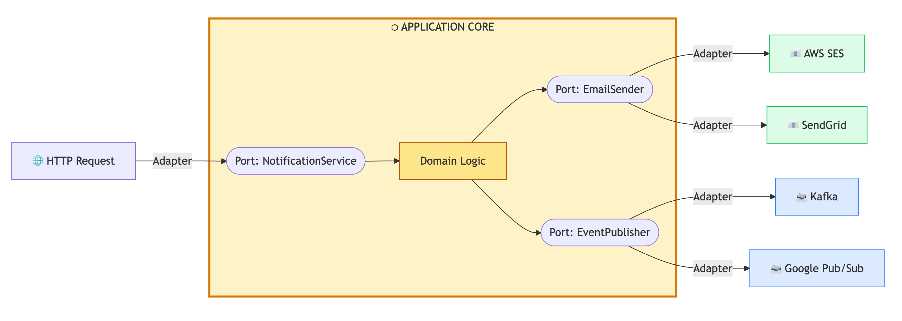

Portability is not defined by the ability to run everywhere simultaneously, as
that is often a path toward over-engineering. It is, more accurately, a
function of reversibility. It provides the technical confidence that if a
migration becomes necessary, the system can support it. This quality is not
derived from a specific cloud provider, but rather from the deliberate layering
of code and environment. While many teams focus on the destination of their
deployment, true portability is found in the methodology of the build.

<!-- truncate -->

### **The Two Fronts**

To keep your options open, you have to work on two fronts.

First, the **Application Layer.** This is your domain logic. It should be
blissfully unaware of whether it's talking to a proprietary cloud queue or a
local database. Second, the **Environment Layer.** This is your config, the
"container" your code lives in. It needs to be reproducible and declarative.
If an environment cannot be recreated with a single command, the system relies
on luck rather than automation.

Most systems don't fail at the deployment stage. They fail in the code. When
your business logic starts calling proprietary SDKs directly, you've stopped
building a product and started building a feature for your cloud provider. You
might be "on Kubernetes," but if your code is married to a specific vendor's
identity service or database quirks, you're stuck.

### **Designing *for* a Cloud is the Trap**

There is no harm in running on one cloud. The risk is making **irreversible
design decisions.** If you build on open interfaces, you can happily stay on
one provider for years while still keeping the power to:

* Spin up a secondary site during a regional meltdown.
* Shift workloads when the "committed spend" math stops adding up.
* Actually negotiate your contract because you have a credible exit.

Portability provides strategic **leverage**

### **'Kafka as a Library' or The Interface-First Mindset**

Take Kafka. It's a great example because it has evolved from a tool into a
protocol. If your app depends on the Kafka *API* rather than a specific
vendor's implementation, Kafka effectively becomes a library. Whether you're
using self-hosted Apache Kafka, a managed service, or something like Redpanda,
your producers and consumers don't care. Only the plumbing changes.

This pattern is everywhere if you look for it:

* **Databases:** Postgres and MySQL protocols.

* **Identity:** OAuth and OIDC.

* **Observability:** OpenTelemetry.

* **Storage:** The S3 API.

The CNCF landscape is more than a list of tools; it's a map of the interfaces
that won. When you see multiple mature implementations for the same protocol,
that's your green light to build. It sets the pace for the entire ecosystem,
signaling to vendors the language the ecosystem now speaks.

### **Business Logic Should Be Ignorant**

Portability fails when your code knows too much. The rule is simple: **Your
business logic should not care where it runs.**

This is where "ports and adapters" (hexagonal architecture) moves from theory
to practical survival. Your domain talks to an interface; your infrastructure
lives behind an adapter.

Yes, this costs something. You pay in abstraction. But 'abstract' shouldn't
mean 'complex.' You aren't introducing a heavy new component or a fragile
moving part; you're just building a wrapper. This is the **adapter pattern** in
its most practical form. The 'adapter' in a **ports and adapters** architecture.
It's the difference between hard-wiring your logic into a vendor's proprietary
API and simply translating their contract into your own domain schema. This
minor friction today prevents a total collision during a high-cost migration
later.

**Portability costs a little every day. Lock-in costs a lot, suddenly.**

### **Intent vs. Instructions**

Layered code is insufficient if standing up in a new environment requires
tribal knowledge. Infrastructure must be reproducible, which is the core of
GitOps. Storing intent is superior to storing instructions, because describing
"what" must exist is more durable than the "how" of a dashboard. Mapping this
intent to specific cloud APIs is a one-time configuration task that moves
cloud-specific friction out of the architecture and into a manageable layer.

GitOps makes this real by storing your **intent** in Git. Now, let's be clear:
this isn't magic. You still have to do the one-time work of mapping that intent
to a specific cloud's APIs whether that's configuring a Crossplane provider, a
Terraform module, or a specific Ingress controller. Think of it as installing a
driver. You do the plumbing once so that your application logic doesn't have to
care about it. Once those mappings are in place, the workflow is identical:
commit, push, sync. You've successfully moved the cloud-specific friction out
of your architecture and into a manageable configuration layer

### **You Don't Need to Move, You Just Need to know you can**

At the end of the day, some decisions are hard to undo. Choosing open
interfaces and declarative configs makes them easier.

It gives you the room to respond to outages, control your costs, and meet new
compliance hurdles without breaking the company.

You don't need to move often or move at all. You just need to know that the
door isn't locked from the outside.

---

What's Next?

In the next post, we'll dig into the stack itself: which protocols actually
preserve your freedom, and which ones are "open" in name only.

## References

* [Ports and Adapters Architecture](https://medium.com/the-software-architecture-chronicles/ports-adapters-architecture-d19f2d476eca)
* [Hexagonal Architecture](https://dzone.com/articles/hexagonal-architecture-is-powerful)
* [Multi-Cloud K8s](https://developer.hashicorp.com/terraform/tutorials/networking/multicloud-kubernetes)
