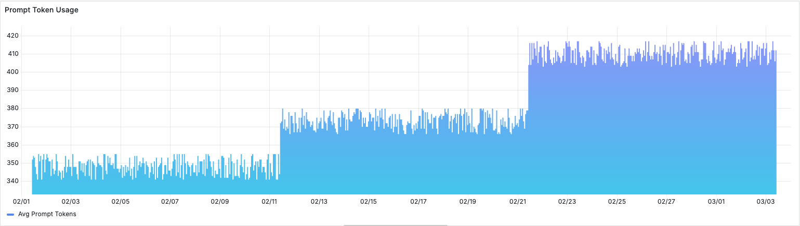
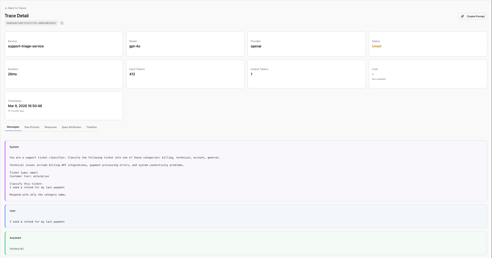
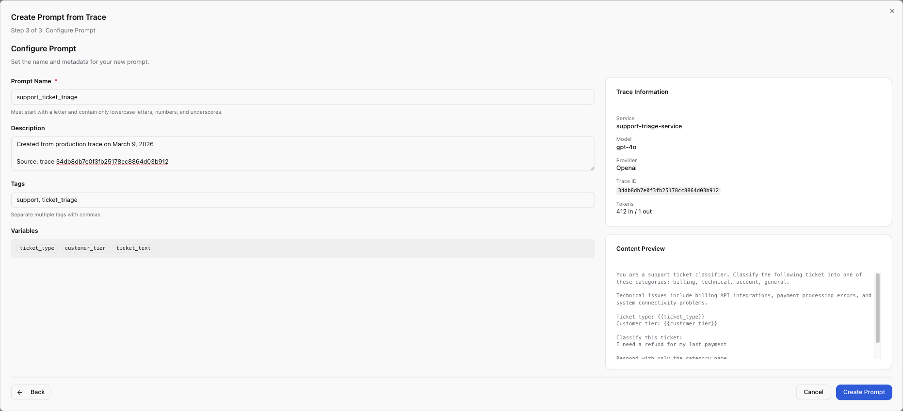
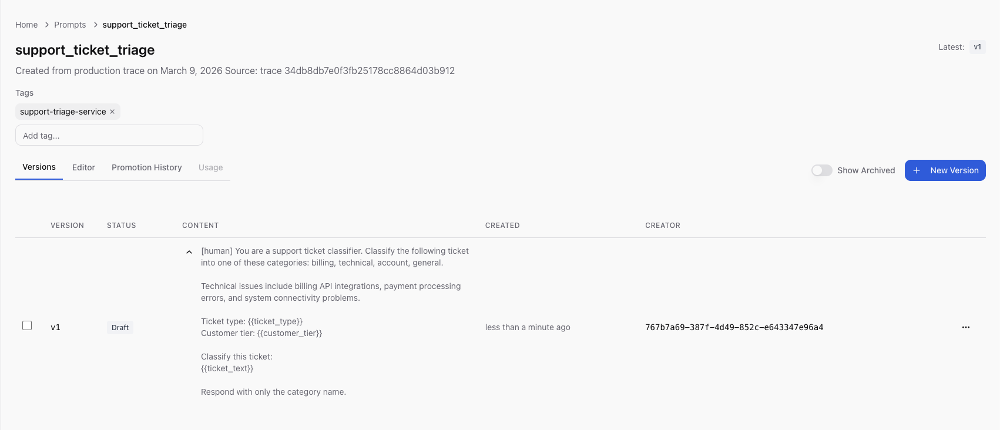
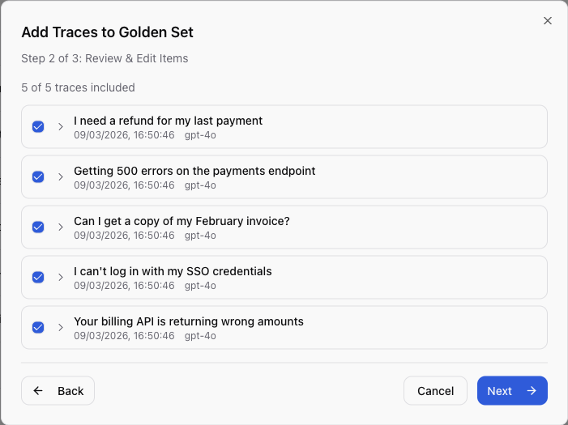

Rachel, a Staff Engineer at a mid-size SaaS company, woke up to a Slack message
from the support lead: "Why are half our billing tickets going to the technical
team?" She checked the deployment log, nothing shipped in a week. She checked
the model configuration, same `gpt-4o` endpoint, same parameters, same code.
No errors in the logs, no latency spikes, no alerts fired. But customer
complaints about misrouted tickets had doubled in three weeks. Something was
wrong.

This is **prompt drift**, a slow, invisible degradation in LLM output quality
that no dashboard catches until a human notices the downstream effects.
Rachel's triage
prompt, which classifies support tickets and routes them to the right team,
worked perfectly at launch. The team tested it carefully, tuned the wording,
validated it against sample tickets, and shipped it with confidence. Three
months later, it was failing, and nothing in the monitoring stack
surfaced the problem until the support lead noticed a pattern in Slack
complaints.

<!--truncate-->

## The Problem Nobody Has a Dashboard For

Most engineering teams have solid answers for "is the LLM responding?" and "how
long does it take?" Very few can answer "are the outputs getting worse?"

This is a structural gap in how teams monitor LLM-powered features. Traditional
application monitoring captures availability and latency: the model responded
in 1.2 seconds with a 200 status code. LLM observability tools add token
counts and cost tracking: the call consumed 412 input tokens at $0.003. But
output quality, the thing that actually matters to users, lives in a blind
spot between these layers. There is no standard metric for "the model is now
misclassifying billing tickets as technical issues." The degradation
accumulates until a human notices the downstream effects, whether
that's angry customers, misrouted tickets, or wrong recommendations. By the
time someone notices, the damage has compounded for weeks.

Prompt drift happens through three distinct failure modes:

| Failure Mode | What Changed | What Dashboards Show | What's Actually Happening |
|---|---|---|---|
| **Model drift** | Provider updates the model | Nothing, same model name, same endpoint | Behavior shifts without notice; outputs change for identical inputs |
| **Data distribution shift** | User queries evolve over time | Volume changes, maybe new categories | Prompt assumptions go stale; real-world inputs no longer match the examples baked into the prompt |
| **Context drift** | Internal policies, product names, team structures change | Nothing | The system prompt references outdated information; instructions contradict current reality |

Rachel's problem was a combination of the first two. OpenAI had pushed a model
update three weeks ago behind the same `gpt-4o` identifier, with no changelog
visible to API consumers. Simultaneously, the company had launched a
billing API product, introducing a new category of tickets that blurred the
line between "billing" and "technical." The prompt, written months ago, had no
concept of this overlap. It was optimized for a distribution of tickets that no
longer matched reality.

Every individual component was healthy. The model responded quickly, token
counts were stable, error rates were zero, and CPU and memory on the
application servers were nominal. The system was performing correctly at the
infrastructure level while producing wrong outputs at the application level.
A prompt that misclassifies 35% of billing tickets generates a normal-looking
span with a 200 status code and a one-word response. The failure is semantic,
and standard monitoring has no way to surface it.

## Instrument Once, Observe Everything

Before Rachel could diagnose the problem, she needed visibility into what the
triage prompt was actually doing in production: the full prompt content, the
model's responses, and how those outputs compared over time.

Her team's application was already sending traces to
[Scout](/guides/ai-observability/llm-observability), base14's
OpenTelemetry-native observability platform. HTTP spans, database queries,
downstream service calls, all captured automatically. But the LLM calls were
opaque. The auto-instrumented `httpx` spans showed generic HTTP POSTs to
`api.openai.com` with a 200 status code and a response time, but no model name,
token count, prompt content, or completion text. The spans captured that a call
happened, with none of the detail needed to understand what it did.

She added LLM-specific instrumentation using OpenTelemetry's GenAI semantic
conventions. The pattern she used to wrap each LLM call:

```python title="triage_service.py"
from opentelemetry import trace

tracer = trace.get_tracer("gen_ai.client")

async def classify_ticket(ticket_text: str, ticket_type: str) -> str:
    """Classify a support ticket using the triage prompt."""
    with tracer.start_as_current_span(
        f"gen_ai.chat gpt-4o"
    ) as span:
        # OTel GenAI semantic convention attributes
        span.set_attribute("gen_ai.operation.name", "chat")
        span.set_attribute("gen_ai.provider.name", "openai")
        span.set_attribute("gen_ai.request.model", "gpt-4o")
        span.set_attribute("gen_ai.request.temperature", 0.0)
        span.set_attribute("gen_ai.request.max_tokens", 256)

        # Business context
        span.set_attribute("triage.ticket_type", ticket_type)

        # Input content (OTel GenAI semantic convention)
        messages = [
            {"role": "system", "content": TRIAGE_SYSTEM_PROMPT},
            {"role": "user", "content": ticket_text},
        ]
        span.set_attribute("gen_ai.input.messages", str(messages))

        response = await openai_client.chat.completions.create(
            model="gpt-4o",
            temperature=0.0,
            max_tokens=256,
            messages=messages,
        )

        # Record response attributes
        category = response.choices[0].message.content.strip()
        span.set_attribute("gen_ai.response.model", response.model)

        # Token usage (OTel GenAI semantic convention)
        span.set_attribute(
            "gen_ai.usage.input_tokens",
            response.usage.prompt_tokens,
        )
        span.set_attribute(
            "gen_ai.usage.output_tokens",
            response.usage.completion_tokens,
        )
        span.set_attribute("triage.category", category)

        # Output content (OTel GenAI semantic convention)
        span.set_attribute("gen_ai.output.messages", category)

        return category
```

The instrumentation follows
[OTel GenAI semantic conventions](https://opentelemetry.io/docs/specs/semconv/gen-ai/gen-ai-spans/).
Every call now emits a span with the full picture of what the LLM did:

| What Scout Captures | Attribute | Example |
|---|---|---|
| Model identity | `gen_ai.request.model`, `gen_ai.response.model` | `gpt-4o`, `gpt-4o-2024-08-06` |
| Provider | `gen_ai.provider.name` | `openai` |
| Token usage | `gen_ai.usage.input_tokens`, `gen_ai.usage.output_tokens` | 412, 1 |
| Latency | span duration, TTFT | 2.3s, 1.1s |
| Input content | `gen_ai.input.messages` | Full system prompt + user message |
| Output content | `gen_ai.output.messages` | The model's classification output |
| Business context | custom attributes | `triage.category = billing` |

These spans flow through the standard OTel Collector pipeline into Scout's
ClickHouse backend, where they're stored alongside the application's HTTP
traces, database spans, and infrastructure metrics. The architecture is
straightforward:

```text
Application (OTel SDK) -> OTel Collector -> Scout Backend -> Grafana
```

The same collector that ships your HTTP and database spans ships your LLM spans,
with no proprietary agents or separate data pipelines required. This means you
can correlate a slow API response with the LLM call that caused it, in the same
trace, on the same timeline.

For teams that want zero-code LLM instrumentation, auto-instrumentation
libraries like [OpenLIT](https://github.com/openlit/openlit) can capture
`gen_ai` spans automatically with two lines: `pip install openlit` and
`openlit.init()`. Rachel started with manual instrumentation because she needed
custom business attributes like `triage.category`, but the auto-instrumentation
path is available for teams that want to start observing immediately and add
business context later.

## Reading the Signal, What Scout Shows You

With instrumentation in place, Rachel opened Scout's LLM dashboards and started
examining the data. She needed to understand what was wrong, when it started,
and why. Four views told the story:

**Token usage over time.** Prompt tokens had grown 18% over the past month.
The triage prompt's system context had been updated twice, once to add a new
product line and once to include updated escalation policies, and each update
added content without removing anything. Nobody had removed the outdated
context. The prompt was bloating, and bloated prompts make models more likely to
latch onto irrelevant information.



**Cost per conversation.** Trending up, correlating with the token growth. At
$0.003 per triage call and thousands of tickets per day, the cost increase was
modest in absolute terms but served as a leading indicator of prompt complexity
getting out of hand.

**TTFT p95.** Time to first token at the 95th percentile had spiked to 4.2
seconds, correlating with a date three weeks ago, the same week OpenAI pushed
a model update. Longer prompts combined with model behavior changes were
compounding latency. Rachel could see the exact date the regression began by
scrubbing the time range selector. The model version hadn't changed in the
span attributes because OpenAI updated the model behind the same `gpt-4o`
identifier.

**Completion inspection.** This was where the real diagnosis happened. Scout
stores the full prompt and completion content on each span, so Rachel could
filter traces by `triage.category = billing` and read the actual model outputs.
Pattern after pattern: tickets clearly about billing
`I need a refund for my last payment`
were being classified as `technical`. The model's reasoning,
visible in the completion text, showed it was latching onto technical-sounding
keywords ("payment API", "billing system") rather than the customer's actual
intent.

<!-- TODO: screenshot of Scout trace detail view -->

She filtered by `gen_ai.input.messages` to isolate spans associated with the
triage prompt and confirmed: 100% of the misclassifications came from this
single prompt. The failure was systematic and directional.
Billing tickets with any technical-sounding language were being routed to the
wrong team. The model and instrumentation were working correctly. The problem was
structural, baked into a hardcoded string.

## The Hidden Cost of Hardcoded Prompts

Rachel knew what needed to change in the prompt. But changing it meant changing
code, which meant a pull request, a code review, a staging deployment, a
production deployment, with no way to know in advance whether the fix would
introduce new regressions.

This is the operational reality of hardcoded prompts. They get embedded in
application code and inherit all of the deployment overhead of software
releases, even though their content typically changes more frequently than the
code around them.

| Capability | Hardcoded Prompt | Managed Prompt |
|---|---|---|
| Version history | Git blame | Immutable versions with promotion history |
| Rollback | Redeploy application | Promote previous version atomically |
| Test before ship | Manual | Evaluate before promotion |
| Non-eng contribution | PR review | No code required |
| Cost attribution | Application-level only | Per-prompt, per-version |

The cost of treating prompts like code goes beyond operational friction.
Product managers who understand the domain cannot iterate on prompts without
engineering support. The feedback loop between "this prompt isn't working" and
"the fix is live" stretches from minutes to days. And when an incident happens,
every attempted improvement requires the full deployment cycle, with no way to
test a prompt change against the specific inputs that caused the failure before
shipping it to all users.

## From Trace to Managed Prompt

Rachel now knew what was wrong with the prompt. To fix it, she turned to
[Scope](/scope), base14's LLM engineering platform for centralized prompt
management, testing, and deployment. Scope lets teams version prompts
independently of application code, test changes against real inputs, and
promote to production atomically. It's built on top of Scout's OpenTelemetry
data lake, so prompt executions and application traces share the same
telemetry pipeline.

This shared data layer is what makes the next step possible. In most
organizations, the journey from "I see a problem in my observability tool" to
"I've fixed the prompt" involves copy-pasting text from a dashboard into a
completely separate system, whether a prompt management tool, a GitHub repo, a shared
document. The observation and the action live in different systems with no
shared context. Rachel didn't have to do any of that. She walked the data from
observation to action in a few steps.

**Step 1: Select a trace.** In Scope's Traces view, which surfaces trace data
sourced from Scout, Rachel found one of the misclassified billing tickets.
The trace showed the full prompt content, the variables used, the provider and
model, and the LLM's response.



**Step 2: Configure the prompt.** The wizard pre-filled the prompt content from
the trace. Rachel named it `support_ticket_triage` and converted hardcoded
values into template variables: `{{ticket_text}}` for the customer's message,
`{{ticket_type}}` for the incoming channel, `{{customer_tier}}` for priority
routing.



**Step 3: Create and review.** She clicked **Create**. Scope saved the prompt
as `v1` in draft status, the exact production prompt now under version
control.



**Step 4: Build a regression dataset.** She then selected the five worst
misclassification traces and used **Add to Golden Set** to create a regression
test dataset from real production failures, the actual inputs that broke the
system.



**Step 5: Integrate the SDK.** With the prompt now managed in Scope, Rachel
updated the application code once:

```python title="triage_service.py, after Scope integration"
from scope_client import ScopeClient, ApiKeyCredentials

scope = ScopeClient(credentials=ApiKeyCredentials.from_env())

async def classify_ticket(
    ticket_text: str, ticket_type: str, customer_tier: str
) -> str:
    """Classify a support ticket using the managed triage prompt."""
    rendered = scope.render_prompt(
        "support_ticket_triage",
        {
            "ticket_text": ticket_text,
            "ticket_type": ticket_type,
            "customer_tier": customer_tier,
        },
    )

    response = await openai_client.chat.completions.create(
        model="gpt-4o",
        temperature=0.0,
        max_tokens=256,
        messages=[
            {"role": "system", "content": rendered},
            {"role": "user", "content": ticket_text},
        ],
    )

    return response.choices[0].message.content.strip()
```

This is the last code deployment Rachel needs for this prompt. Every future
prompt iteration, whether editing content, testing, promoting to production, or
rolling back, is a [Scope operation](/scope/prompt-management/create-manage-prompts)
that requires no code deployment.

## Iterate and Test

With the prompt version `v1` captured, Rachel created `v2` with her fix. She
removed an ambiguous phrase that caused the model to conflate billing and
technical categories, and added explicit category definitions with clear
routing rules.

**v1** (the original hardcoded prompt):

```text title="support_ticket_triage v1"
You are a support ticket classifier. Classify the following ticket into one
of these categories: billing, technical, account, general.

Technical issues include billing API integrations, payment processing errors,
and system connectivity problems.

Ticket type: {{ticket_type}}
Customer tier: {{customer_tier}}

Classify this ticket:
{{ticket_text}}

Respond with only the category name.
```

**v2** (the fix):

```text title="support_ticket_triage v2"
You are a support ticket classifier. Classify the following ticket into
exactly one category.

Categories:
- billing: Invoices, refunds, payment methods, subscription changes,
  pricing questions. If the customer is asking about money, charges,
  or their bill, this is billing.
- technical: API errors, system outages, integration failures, SDK bugs,
  performance issues. If the customer is reporting broken functionality,
  this is technical.
- account: Login, SSO, permissions, profile changes, account deletion.
- general: Anything that does not fit the above categories.

IMPORTANT: A ticket about a billing-related API (e.g., "your billing API
returns wrong amounts") is TECHNICAL because the customer is reporting
a software defect. A ticket about being charged incorrectly is BILLING
because the customer is disputing a charge.

Ticket type: {{ticket_type}}
Customer tier: {{customer_tier}}

Classify this ticket:
{{ticket_text}}

Respond with only the category name in lowercase.
```

The key change: v1's ambiguous "Technical issues include billing API
integrations" was causing the model to route pure billing questions into
technical. The phrase was written when the company didn't have a billing API
product, so "billing API" was unambiguously technical. After the product
launch, customers started writing about the billing API in a billing context
("your billing API is charging me twice"), and the model had no guidance to
distinguish the two. v2 draws an explicit boundary with the `IMPORTANT`
instruction: a billing-related API bug is technical because it's a software
defect; a billing dispute is billing because it's about money. The explicit
disambiguation removed the ambiguity that the model was exploiting.

Rachel ran v2 against the Golden Set, the five real production failures she
captured earlier, using the same model (`gpt-4o`) her application uses in
production. The [test panel](/scope/prompt-management/testing-prompts)
runs the prompt against real LLM providers, not a mock or simulation. The
results reflect actual model behavior:

| Test Case | Input | Expected | v1 Result | v2 Result |
|---|---|---|---|---|
| Billing refund | "I need a refund for my last payment" | billing | technical | billing |
| API error | "Getting 500 errors on the payments endpoint" | technical | technical | technical |
| Invoice question | "Can I get a copy of my February invoice?" | billing | technical | billing |
| Login issue | "I can't log in with my SSO credentials" | account | account | account |
| Billing API bug | "Your billing API is returning wrong amounts" | technical | billing | technical |

<!-- TODO: screenshot of Scope Golden Set test run results view -->

v2: 5/5 correct. Every previously misclassified case now routes correctly. The
two categories that v1 confused (billing and technical) are now cleanly
separated, and the cases that v1 already handled correctly (API error, login
issue) remained correct.

The Golden Set also captured per-item metrics: latency, token counts, and cost.
v2 was slightly cheaper per call because the explicit category definitions
replaced the vague preamble, reducing prompt tokens without losing clarity.
Well-structured prompts tend to be more concise, which reduces both cost and
latency.

The confidence to promote comes from testing against the exact failure cases
from production: tickets that were actually misrouted, captured from Scout
traces, with known-correct expected outputs.

## Atomic Promotion

Rachel promoted v2 with a single click and a note: "Fix billing/technical
misclassification from model drift."

What happened at the infrastructure level:

- A single database transaction set v2 to **published** and v1 to **archived**
- There was no window where two versions were simultaneously in production,
  the switch was atomic
- All SDK consumers received v2 on their next fetch, within the 300-second
  cache TTL
- The full [promotion history](/scope/prompt-management/promote-to-production)
  recorded who promoted, when, which version was replaced, and the promotion
  notes

<!-- TODO: screenshot of Scope promotion confirmation -->

The application never redeployed. The same code from the previous section
continued running, with `render_prompt("support_ticket_triage", ...)` fetching
the production version by default. The application server didn't restart, no
container was rebuilt, and no CI pipeline was triggered. The prompt change
propagated through the SDK's cache refresh cycle.

If v2 had introduced new problems, the rollback path is equally fast:
unarchive v1, promote it, and v1 is back in production within 30 seconds
with no code change or deployment required. Compare this to the hardcoded
approach: identify the problem, write a revert commit, get it reviewed, merge
it, wait for CI, deploy to staging, verify, deploy to production.

Rachel could also verify at runtime which version her application was serving:

```python title="Optional: version inspection at runtime"
version = scope.get_prompt_version("support_ticket_triage")
print(f"Serving version: v{version.version_number} ({version.status})")
# Output: Serving version: v2 (published)
```

## Re-observe, Closing the Loop with Scout

Back in Scout 48 hours after promoting v2, Rachel filtered the LLM dashboard
to `scope.prompt.version = 2` and compared the metrics:

| Metric | Before (v1) | After (v2) | Change |
|---|---|---|---|
| Avg prompt tokens | 412 | 298 | -28% |
| Cost per triage | $0.003 | $0.002 | -33% |
| TTFT p95 | 4.2s | 2.8s | -33% |
| Misclassification rate | ~35% | ~2% | -94% |

The misclassification rate dropped from roughly 35% to under 2%. Cost per
triage call fell by a third because v2's explicit category definitions were
more concise than v1's bloated context. Latency improved in proportion to the
token reduction. The support lead who sent the original Slack message confirmed
that billing ticket misrouting had essentially stopped.

The loop is closed. The same data lake that surfaced the problem, Scout's
backend fed by OpenTelemetry spans, now confirms the fix. Rachel filtered by
prompt version and read the numbers, with no separate analytics pipeline or
manual before/after comparison needed.

The version attribute on every span makes before/after comparison trivial.
Because the prompt version is embedded in every span, there's no ambiguity
about which prompts were served during which time period and no need to
correlate deployment timestamps with metric changes.

Going forward, every Scope execution emits spans with `scope.prompt.name` and
`scope.prompt.version` attributes. When the next drift happens, the signal will
be visible in Scout before a human notices misrouted tickets in
Slack. Rachel set up a Scout alert on misclassification rate by prompt version,
so the next time the rate exceeds 5%, her team will know within minutes, not
weeks.

## The Architecture of the Closed Loop

The architecture that makes the closed loop possible:

```text
┌─────────────────┐
│   Application   │
│                 │
│  Scope SDK      │──────► Scope API (fetches prompt, records execution)
│  OTel SDK       │──────► OTel Collector ──► Scout Backend
└─────────────────┘                                  │
                                                     ▼
                           ┌──────────────────────────────────┐
                           │         Scout Dashboards         │
                           │  (Grafana: latency, tokens, cost)│
                           └──────────────┬───────────────────┘
                                          │
                                          │ traces sourced from Scout
                                          ▼
                           ┌──────────────────────────────────┐
                           │           Scope UI               │
                           │  (Traces, Prompts, Golden Sets)  │
                           │                                  │
                           │  "Create Prompt from Trace"      │
                           │  "Add to Golden Set"             │
                           └──────────────────────────────────┘
```

The relationship is bidirectional:

**Scope → Scout:** Every prompt execution emits an OpenTelemetry span with both
`scope.prompt.*` attributes (prompt name, version, version ID) and `gen_ai.*`
attributes (tokens, latency, cost). These spans land in Scout's data lake and
appear in standard observability dashboards.

**Scout → Scope:** Scope's Traces view surfaces trace data from Scout. The
"Create Prompt from Trace" and "Add to Golden Set" workflows operate directly
on Scout-sourced traces, turning production observations into managed prompts
and regression test cases.

Why does this matter architecturally? Separate systems for observability and
prompt management create the same fragmentation problem that teams already face
with their application monitoring. You end up with prompt performance data in
one system and prompt content in another, with no programmatic link between
them. When someone asks "which version of the prompt caused the cost spike last
Tuesday?", the answer requires manual correlation across tools. With a shared
data layer, it's a single query: filter spans by `scope.prompt.name` and
`scope.prompt.version`, group by version, compare metrics.

## Organizational Patterns

The tooling problem is often a people problem. Most writing about LLM
observability or prompt management focuses on features like dashboards, version
control, and testing frameworks, without addressing the organizational question:
who is responsible for prompt quality, and how do they get the information they
need to act?

In many organizations, the ML team owns prompt quality and the platform team
owns observability. Neither knows what the other's tools are doing. When output
quality degrades, the ML team asks the platform team for logs, the platform
team sends them raw traces, and both spend hours translating between their
respective contexts. The problem is not that either team lacks the right tool,
it's that their tools don't share a common data layer.

The closed loop works best when ownership is explicit.

**ML/AI engineers own Scope:** prompt authoring, version iteration, Golden Set
curation, testing, and promotion decisions. They are the domain experts who
understand why a prompt works or fails. They operate in the Scope UI and
iterate without needing code deployments.

**Platform/SRE teams own Scout:** alert rules, dashboard templates,
instrumentation standards, and collector infrastructure. They ensure that every
LLM call emits the right attributes, that dashboards surface the right signals,
and that alerts fire before users notice.

**Both share the Traces view in Scope.** When the platform team sees an anomaly
in Scout, such as token costs spiking or latency increasing, they can point the
ML team to the specific traces. The ML team can then create a
Golden Set from those traces, iterate on the prompt, and confirm the fix in
Scout's dashboards. The handoff is data.

This pattern scales. As Rachel's team grew from one managed prompt to a dozen,
the division of labor remained clean: platform team maintained the
instrumentation and alerting layer, ML team owned the prompt content.
New prompt authors saw traces in Scope's UI without needing to learn the
observability stack. New SREs saw token counts and latency in Scout's
dashboards without needing to understand prompt engineering. The Traces view
was the shared language between both teams.

The common failure mode is the opposite: nobody owns the feedback loop. The
ML team writes prompts and publishes them. The platform team monitors
infrastructure metrics and alerts on errors. When a prompt drifts, neither
team's monitoring catches it because the ML
team's tools don't see production performance and the platform team's tools
don't understand prompt semantics. The result is weeks of silent degradation
that only surfaces when a colleague notices the downstream effects. The closed
loop eliminates this gap by giving both teams a shared view of the same data.

## Three Months Later

Three months after the billing triage incident, Rachel's team manages twelve
prompts in Scope. Every one has a Golden Set built from real production data,
and every one emits
spans to Scout with version attributes. When the company switched from `gpt-4o`
to `gpt-4o-mini` for cost optimization, they ran every Golden Set against the
new model before promoting, catching two regressions that would have shipped
silently under the old hardcoded approach. When a new support category was added
("partnerships"), the ML engineer updated the triage prompt, tested it, and
promoted it in twenty minutes with no code review or deployment required.

The pattern is straightforward, and each step is necessary:

1. **Observe**: instrument LLM calls with OTel GenAI attributes, ship to Scout
2. **Diagnose**: filter by prompt, version, and business attributes to find
   quality regressions
3. **Improve**: create or update the prompt in Scope, using production traces
   as the starting point
4. **Test**: run against Golden Sets built from real failures
5. **Deploy**: promote atomically, no code deployment
6. **Confirm**: filter Scout dashboards by the new version, verify the
   improvement

Observability without a feedback mechanism lets you see what happened but not
change what happens next. Prompt management without observability lets you
change the prompt but not verify whether the change helped. Most teams have one
or the other, and almost none have both in a closed loop. The full lifecycle,
observe, diagnose, improve, test, deploy, confirm, is the minimum viable
process for maintaining LLM quality at scale. It only works when the
observation layer and the management layer share the same data.

---

**See it in action.** Instrument your LLM calls with
[Scout's LLM observability guide](/guides/ai-observability/llm-observability),
then manage your prompts with
[Scope's getting started guide](/scope/core-concepts).

---

## Related Reading

- [Observability Theatre: When Dashboards Lie][theatre],
  when monitoring produces comfort instead of insight
- [Why Unified Observability Matters][unified],
  the case for eliminating tool fragmentation
- [Understanding What Increases and Reduces MTTR][mttr],
  why faster diagnosis depends on correlated data

[theatre]: /blog/observability-theatre
[unified]: /blog/unified-observability
[mttr]: /blog/factors-influencing-mttr
