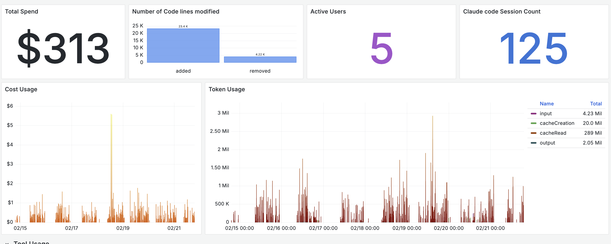
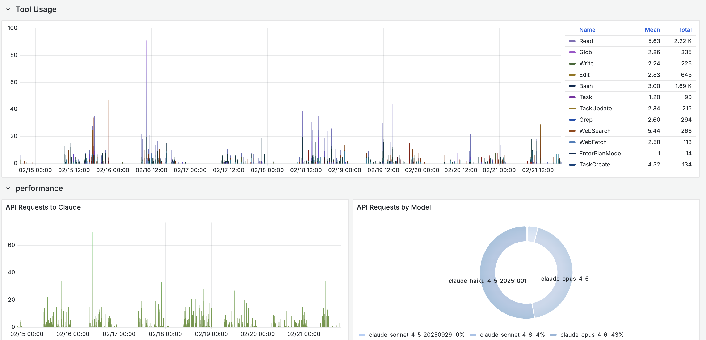

Coding agents like Claude Code, OpenAI Codex CLI, and Google Gemini CLI now ship
with native OpenTelemetry support. This means you can collect structured
telemetry covering token usage, cost attribution, tool calls, sessions, and
lines of code modified, the same way you instrument any other production system.

This post covers what each agent emits, how to enable collection, and what we
learned running Claude Code telemetry across a team.

<!--truncate-->

## The Case for Instrumenting Coding Agents

Treating coding agents as individual developer tools creates blind spots.
Instrumenting these tools allows teams to measure aggregate behavior and make
data-driven decisions.

When coding agents are black boxes, we rely on assumptions:

- **Cost attribution is a guess.** You know the monthly total but not which
  projects, engineers, or workflows drive the spend.
- **Model routing is invisible.** Agents route requests across models
  automatically. Without telemetry, you cannot see which model handles which
  tasks or whether the routing is efficient.
- **Usage patterns vary widely.** Session length, tool preference, request
  volume, and time-of-day activity differ meaningfully per engineer. Aggregated
  metrics hide these differences.
- **Optimization decisions lack evidence.** Should you change plans? Adjust
  context limits? Restrict certain tools? Without data, these decisions are
  opinion-based.
- **Adoption is unmeasured.** You rolled out an agent to your team but have no
  visibility into who is actually using it, how frequently, or whether new
  engineers are ramping up at all. Session and user-level telemetry turns
  adoption from anecdote into data.
- **Effectiveness is unquantified.** Lines of code modified, commits generated,
  and tool call patterns are proxies for productivity that only exist if you
  collect them.

## What Each Agent Emits

All three major coding agents now support OpenTelemetry export. The depth of
instrumentation varies significantly.

### Claude Code

Claude Code emits **metrics and logs** via OTLP, but not traces. Enable it with
`CLAUDE_CODE_ENABLE_TELEMETRY=1` and point to a collector endpoint.

**Metrics:**

| Metric | Description |
|--------|-------------|
| `claude_code.session.count` | Session initiations |
| `claude_code.token.usage` | Input, output, cache read, and cache creation tokens per model |
| `claude_code.cost.usage` | Estimated USD cost by model |
| `claude_code.lines_of_code.count` | Lines added or removed |
| `claude_code.commit.count` | Git commits generated |
| `claude_code.pull_request.count` | Pull requests created |
| `claude_code.code_edit_tool.decision` | Accept/reject counts per tool |
| `claude_code.active_time.total` | Duration split between user input and CLI processing |

**Log events:**

| Event | Key Attributes |
|-------|----------------|
| `claude_code.user_prompt` | Prompt length (content redacted by default) |
| `claude_code.api_request` | Token counts, cost, latency, model |
| `claude_code.api_error` | HTTP status, error message |
| `claude_code.tool_result` | Tool name, success/failure, duration, decision |
| `claude_code.tool_decision` | Accept/reject per tool |

**Common attributes:** `session.id`, `user.account_uuid`, `user.email`,
`organization.id`, `app.version`, `terminal.type`.

**Configuration:**

```bash
export CLAUDE_CODE_ENABLE_TELEMETRY=1
export OTEL_EXPORTER_OTLP_ENDPOINT=https://your-collector:4318
export OTEL_EXPORTER_OTLP_HEADERS="Authorization=Bearer <token>"
export OTEL_EXPORTER_OTLP_METRICS_TEMPORALITY_PREFERENCE=delta
```

Optional flags control cardinality and privacy: `OTEL_LOG_USER_PROMPTS`,
`OTEL_LOG_TOOL_DETAILS`, `OTEL_METRICS_INCLUDE_SESSION_ID`.

### OpenAI Codex CLI

Codex CLI emits **traces, metrics, and logs** via OTLP. Configure in
`~/.codex/config.toml`. Supports both gRPC and HTTP exporters.

**Metrics:**

| Metric | Type |
|--------|------|
| `codex.tool.call` | Counter |
| `codex.tool.call.duration_ms` | Histogram |
| `codex.api_request` | Counter |
| `codex.api_request.duration_ms` | Histogram |
| `codex.sse_event` / `codex.websocket.event` | Counter + Histogram |
| `codex.responses_api_overhead.duration_ms` | Histogram |
| `codex.responses_api_inference_time.duration_ms` | Histogram |

**Log events:**

| Event | Key Attributes |
|-------|----------------|
| `codex.conversation_starts` | Model, reasoning effort, security policy, context window |
| `codex.api_request` | Status, duration, token counts (input, output, cached, reasoning, tool) |
| `codex.user_prompt` | Prompt length, image counts (redacted by default) |
| `codex.tool_result` | Tool name, duration, output length, MCP server/tool info |
| `codex.tool_decision` | Decision, source (config or user) |
| `codex.api_error` | HTTP status, error message |

**Token attributes:** `input_token_count`, `output_token_count`,
`cached_token_count`, `reasoning_token_count`, `tool_token_count`.

**Known limitations:** Metrics are not emitted in `codex exec` mode, and no
telemetry is available in `codex mcp-server` mode (tracked in
[#12913](https://github.com/openai/codex/issues/12913)).

**Configuration:**

```toml
# ~/.codex/config.toml
[otel]
exporter = { otlp-grpc = { endpoint = "https://your-collector:4317" } }
trace_exporter = { otlp-grpc = { endpoint = "https://your-collector:4317" } }
metrics_exporter = { otlp-grpc = { endpoint = "https://your-collector:4317" } }
log_user_prompt = false
```

### Google Gemini CLI

Gemini CLI has the most comprehensive instrumentation of the three. It emits
**traces, metrics, and logs** and follows the
[OpenTelemetry GenAI Semantic Conventions](https://opentelemetry.io/docs/specs/semconv/gen-ai/gen-ai-spans/).

**Metrics:**

| Metric | Type |
|--------|------|
| `gemini_cli.session.count` | Counter |
| `gemini_cli.tool.call.count` | Counter |
| `gemini_cli.tool.call.latency` | Histogram (ms) |
| `gemini_cli.api.request.count` | Counter |
| `gemini_cli.api.request.latency` | Histogram (ms) |
| `gemini_cli.token.usage` | Counter (tokens) |
| `gemini_cli.file.operation.count` | Counter |
| `gemini_cli.chat_compression` | Counter |
| `gen_ai.client.token.usage` | Histogram (GenAI semconv) |
| `gen_ai.client.operation.duration` | Histogram (GenAI semconv) |

**Log events:**

| Event | Key Attributes |
|-------|----------------|
| `gemini_cli.config` | Model, sandbox, approval mode, MCP servers |
| `gemini_cli.user_prompt` | Prompt length, auth type |
| `gemini_cli.api_response` | Model, status, duration, input/output/cached/thoughts/tool token counts |
| `gemini_cli.tool_call` | Function name, args, duration, decision, success |
| `gemini_cli.file_operation` | Operation type, lines, language, diff stats (AI vs user) |
| `gemini_cli.model_routing` | Router decisions with latency and reasoning |
| `gemini_cli.chat_compression` | Tokens before/after compression |
| `gemini_cli.extension_*` | Extension install/enable/uninstall events |

**Trace spans** follow GenAI semantic conventions with attributes like
`gen_ai.operation.name`, `gen_ai.agent.name`, `gen_ai.request.model`, and
`gen_ai.response.model`.

Gemini CLI also provides a pre-configured **Google Cloud Monitoring dashboard**
out of the box.

**Configuration:**

```json
// .gemini/settings.json
{
  "telemetry": {
    "enabled": true,
    "otlpEndpoint": "http://your-collector:4317",
    "otlpProtocol": "grpc",
    "logPrompts": true
  }
}
```

Or via environment variables: `GEMINI_TELEMETRY_ENABLED`,
`GEMINI_TELEMETRY_OTLP_ENDPOINT`, `GEMINI_TELEMETRY_OTLP_PROTOCOL`.

## Comparison Table

| Capability | Claude Code | Codex CLI | Gemini CLI |
|-----------|-------------|-----------|------------|
| **OTLP Signals** | Metrics, Logs | Traces, Metrics, Logs | Traces, Metrics, Logs |
| **Token usage** | Input, output, cache read, cache creation | Input, output, cached, reasoning, tool | Input, output, cached, thoughts, tool |
| **Cost attribution** | Yes (`cost.usage` by model) | No native metric | No native metric |
| **Session tracking** | Yes (`session.count`, `session.id`) | Yes (`conversation.id`) | Yes (`session.count`, `session.id`) |
| **Tool call metrics** | Yes (decision counts) | Yes (count + duration histogram) | Yes (count + latency histogram) |
| **Lines of code** | Yes (`lines_of_code.count`) | No native metric | Yes (`file_operation` with diff stats) |
| **Commit/PR tracking** | Yes (`commit.count`, `pull_request.count`) | No | No |
| **Model routing visibility** | Via log events | Via log events | Dedicated `model_routing` event |
| **User identity** | `user.account_uuid`, `user.email` | `user.account_id`, `user.email` | `installation.id`, `user.email` |
| **GenAI semconv** | No | No | Yes |
| **Prompt redaction** | Redacted by default, opt-in | Redacted by default, opt-in | Logged by default, opt-out |
| **Pre-built dashboard** | No | No | Yes (Google Cloud Monitoring) |
| **Exporter protocol** | HTTP/protobuf | gRPC or HTTP | gRPC or HTTP |

## What We Learned Running Claude Code Telemetry

We enabled telemetry on Claude Code across five engineers on the Max plan and
collected data for seven days. Engineers had the ability to disable telemetry
temporarily. A few patterns stood out.





### Cache reads dominate token usage

The token breakdown showed cache read tokens significantly outweighing other
categories. In our sample, cache reads accounted for 289 million tokens versus
4.23 million input tokens. Prompt caching is materially reducing incremental
cost, and without instrumentation this would be difficult to quantify.

### Haiku handles a majority of requests

Even on higher-tier plans, the routing layer delegates a large share of
sub-agent tasks like tool calls, file operations, and code searches to Haiku.
More than half of API requests in our sample were served by the lighter model,
with Opus handling 43% and Sonnet under 5%. The system optimizes cost and
latency automatically, but the distribution is only visible through
instrumentation.

### Usage behavior varies across engineers

Session length, tool preference, request volume, and time-of-day activity
differed meaningfully per user. One engineer ran long, exploratory sessions with
heavy tool use. Another ran short, targeted prompts. Aggregated metrics hid
these differences completely. Per-user and per-session views are necessary to
understand actual consumption patterns.

### Adoption becomes visible

With 125 sessions across five engineers in a week, we could see who was using
the agent daily and who had not touched it since the initial setup. One engineer
accounted for nearly half of the token usage. Another had very low usage. The
data prompted a conversation about workflows and onboarding that would not have
happened without the numbers.

### Effectiveness has proxies worth tracking

Over the seven-day window, the team generated over 25,000 lines of code
modifications across 125 sessions. Combining `lines_of_code.count` with
`commit.count` and `tool_result` events gives a rough picture of output per
session. The engineer with the highest session count also had the highest Read
and Bash tool usage, suggesting deep exploratory work. The engineer with fewer
but longer sessions leaned heavily on Edit and Write, suggesting more directed
code generation.

Of course, lines of code is a flawed proxy for value generated. We used
frontier models to
analyze the tool usage patterns and session behavior, which itself requires
having telemetry in the first place. The value is less in any single metric and
more in building a baseline that teams can reason about over time.

## Getting Started

Regardless of which agent your team uses, the setup follows the same pattern:

1. **Enable telemetry.** Set the agent's telemetry flag (environment variable or
   config file).
2. **Point to a collector.** Any OTLP-compatible backend works: your existing
   observability platform, a standalone OpenTelemetry Collector, or a managed
   service.
3. **Add resource attributes.** Tag with team, project, or environment to enable
   useful grouping.
4. **Build views.** Start with per-user token usage and cost, then drill into
   tool call patterns and session behavior.

The telemetry is already there. You just need to collect it.

## What Comes Next

The GenAI semantic conventions that Gemini CLI already follows will likely become
the standard. As these conventions mature, expect Claude Code and Codex to adopt
them, making cross-agent dashboards and alerting more straightforward.

Once coding agent telemetry is collected alongside CI/CD metrics, deployment
frequency, and incident data, teams can start correlating agent usage with
engineering outcomes. That is the real payoff: moving from "how much did we
spend" to "what did we get for it."

---

If your team is instrumenting AI workflows and wants help operationalizing the
telemetry, [reach out to the base14 team](https://base14.io/contact).
